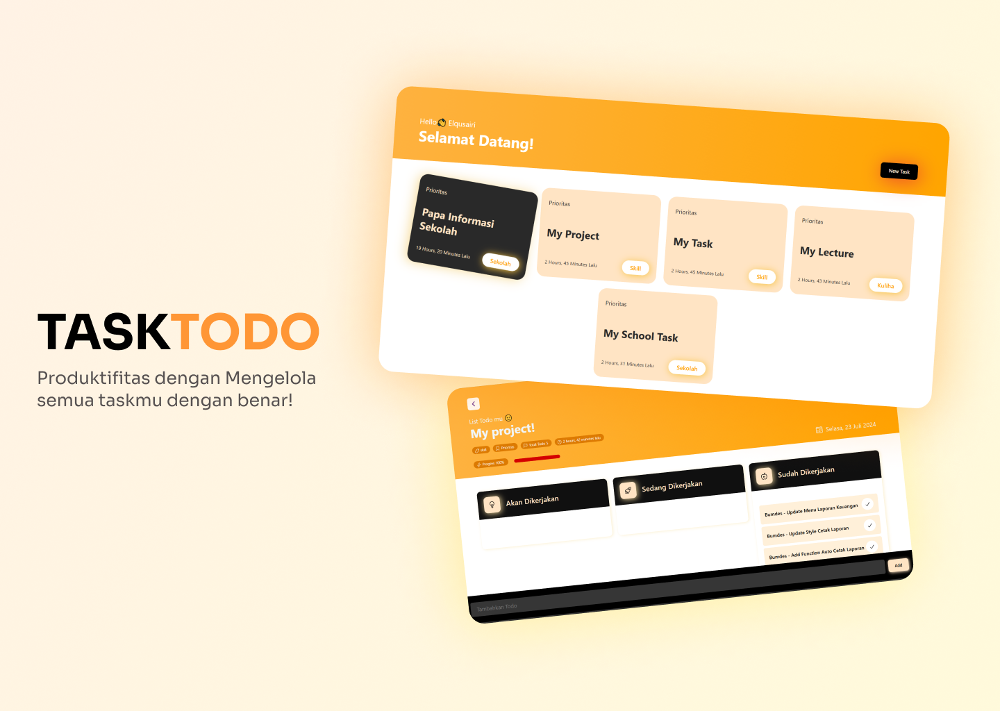

<div class="" align="center">
    <p>Task Todo</p>
    <h1>APPS TASK TODO</h1>
    <span>✨⭐⭐⭐✨</span>
    <hr>
    
 
    <br>
</div>

## Setup Project

<strong>Instalasi</strong>

- 📍&nbsp;&nbsp;[Install Python (Python Official)](https://www.python.org/)
- 📗&nbsp;&nbsp;Clone repository
```bash
git clone https://github.com/ENONGLOSKER/taskTodo.git
```

- 📁&nbsp;&nbsp;Masuk ke Folder
```bash
cd task_project
```
- 📁&nbsp;&nbsp;Install requirements
```bash
pip install -r requirement.txt
```
- 📁&nbsp;&nbsp;Run Server
```bash
python manage.py runserver
```
<br>

- 📁&nbsp;&nbsp; Jika ada Update tinggal
```bash
git pull origin master
```
